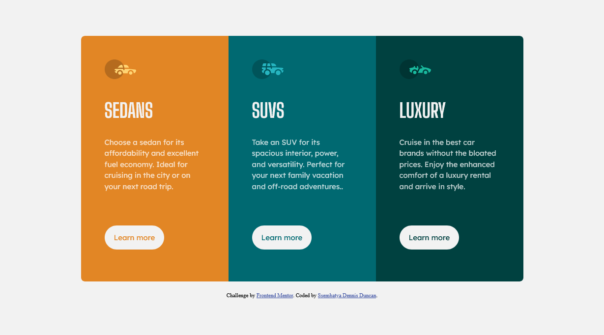

# Frontend Mentor - 3-column preview card component solution

This is a solution to the [3-column preview card component challenge on Frontend Mentor](https://www.frontendmentor.io/challenges/3column-preview-card-component-pH92eAR2-). Frontend Mentor challenges help you improve your coding skills by building realistic projects.

### The challenge

Users should be able to:

- View the optimal layout depending on their device's screen size
- See hover states for interactive elements

### Screenshot

### Links

- Solution URL: [3-column preview card component challenge on Frontend Mentor](https://www.frontendmentor.io/solutions/responsive-3-column-preview-card-component-with-css-flexbox-Tj1WCCfvpX)
- Live Site URL: [3-column preview card component challenge on Frontend Mentor](https://3-column-preview-card-component-dun-nine.vercel.app/)

### Built with

- Semantic HTML5 markup
- CSS
- Flexbox

## Author

- Frontend Mentor - [@ssembatya-dennis](https://www.frontendmentor.io/profile/ssembatya-dennis)
- Twitter - [@DennisSsembatya](https://twitter.com/DennisSsembatya)
